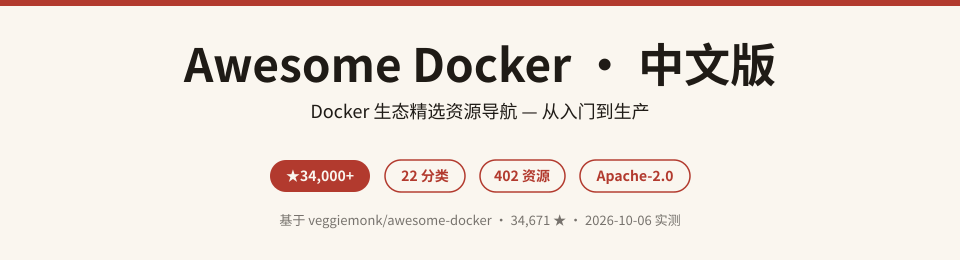
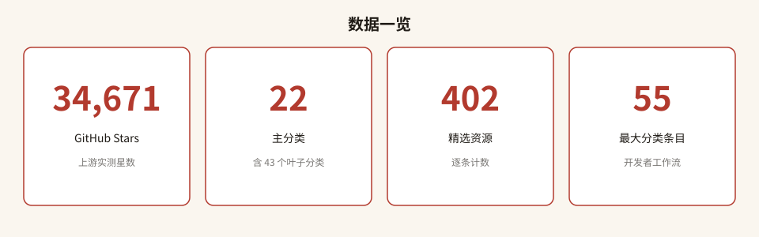
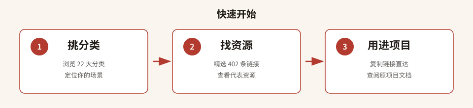

# Awesome Docker · 中文版

> **Docker 生态精选资源导航 — 中文版**
> 基于 [veggiemonk/awesome-docker](https://github.com/veggiemonk/awesome-docker)（GitHub 34,671 ★）整理的中文分类索引，覆盖 **22 大分类 · 402 条精选资源**，从入门到生产一站直达。

---

## 目录

- [这是什么](#这是什么)
- [为什么值得收藏](#为什么值得收藏)
- [数据一览](#数据一览)
- [快速开始](#快速开始)
- [分类清单](#分类清单)
- [精选条目索引](#精选条目索引)
- [全量索引说明](#全量索引说明)
- [FAQ](#faq)
- [参与贡献](#参与贡献)
- [致谢](#致谢)
- [许可声明](#许可声明)

---

## 这是什么

**Awesome Docker · 中文版** 是对国际知名开源项目 [veggiemonk/awesome-docker](https://github.com/veggiemonk/awesome-docker) 的中文导航索引。

原项目由 Docker 社区志愿者维护，收录了 Docker 生态中经过筛选的工具、框架、教程、平台与服务，涵盖镜像构建、容器编排、安全扫描、监控告警、CI/CD、开发环境等完整生命周期。本仓将这些分类全部译为中文，并标注每类条目数量与代表资源，方便中文开发者快速定位所需工具。

> 本仓仅做 **中文分类索引与导航**，不复制原 README 的英文正文。所有链接指向原始开源项目或官方文档。

---

## 为什么值得收藏

- **34,671 ★ 社区验证**：原项目是 Docker 生态最权威的精选列表之一，经数万开发者共同验证。
- **22 大分类 · 402 条资源**：从引擎运行时到镜像生命周期，从编排部署到安全合规，一站式覆盖。
- **中文导航降低门槛**：每个分类均附中文译名、条目数与代表资源，无需通读英文原文即可找到目标。
- **持续跟踪上游**：分类结构与条目数基于 2026-10-06 实测，统计口径透明可复核。
- **Apache-2.0 开源**：与上游许可一致，自由使用、修改与分发。

---

## 数据一览

---

## 快速开始

1. **挑分类**：根据你的场景（构建镜像 / 编排部署 / 安全扫描 / 监控告警…）在下方分类清单中定位。
2. **找资源**：点击代表资源或前往 [docker-index.md](docker-index.md) 查看该分类全量条目。
3. **用进项目**：复制链接到浏览器，直接查阅原始项目文档或源码仓库。

---

## 分类清单

> 以下为 22 大主分类的中文导航。每类附条目数与 2–3 条代表资源。

| # | 中文分类 | 英文原名 | 条目数 | 代表资源 |
|---|---------|---------|-------|---------|
| 1 | 官方项目 | Official Projects | 4 | Moby、Docker Hub、Docker Compose |
| 2 | 引擎与运行时 | Engine & Runtime | 10 | containerd、podman、runC、gVisor |
| 3 | 构建镜像 | Building Images | 33 | BuildKit、buildx、DockerSlim、earthly、ko、distroless、Hadolint |
| 4 | 镜像生命周期 | Image Lifecycle | 43 | Harbor、Docker Hub、Trivy、Grype、Syft、cosign、crane |
| 5 | 运行容器 | Running Containers | 41 | Kubernetes、Nomad、Rancher、Dokku、kompose |
| 6 | 网络与代理 | Networking & Proxies | 18 | Calico、Flannel、Traefik、nginx-proxy、Caddy |
| 7 | 存储与数据 | Storage & Data | 7 | REX-Ray、portworx、Docker Volume Backup |
| 8 | 可观测性 | Observability | 23 | cAdvisor、Prometheus、Grafana、Dozzle、Datadog |
| 9 | 安全 | Security | 16 | docker-bench-security、Falco、Trivy、Checkov、Aqua |
| 10 | 用户界面 | User Interfaces | 49 | Portainer、lazydocker、dockge、Docker Desktop |
| 11 | 开发者工作流 | Developer Workflow | 55 | Drone、GitLab Runner、Tekton、Lando、Laradock |
| 12 | 容器内工具 | In-Container Tooling | 11 | docker-gen、GoSu、Ofelia、supercronic |
| 13 | 入门指南 | Where to Start | 21 | Docker 官方文档、Play With Docker、The Docker Handbook |
| 14 | Windows 入门 | Where to Start (Windows) | 7 | Windows Containers 快速入门、ASP.NET Core + Docker |
| 15 | 书籍与教程 | Books & Tutorials | 10 | Docker in Action、Docker in Practice、CNCF Landscape |
| 16 | 精选列表 | Awesome Lists | 6 | Awesome Compose、Awesome Kubernetes、Awesome Selfhosted |
| 17 | 演示与示例 | Demos and Examples | 3 | Local Docker DB、Webstack-micro |
| 18 | 实用技巧 | Good Tips | 5 | Dockerfile 最佳实践、Docker Compose 锚点技巧 |
| 19 | 树莓派与 ARM | Raspberry Pi & ARM | 4 | HypriotOS、balena、armhf Wiki |
| 20 | 安全文章 | Security Articles | 13 | Snyk 镜像安全最佳实践、Docker 安全部署指南 |
| 21 | 视频教程 | Videos | 16 | Docker for Developers、Docker Swarm from scratch |
| 22 | 社区与聚会 | Communities and Meetups | 7 | Docker Reddit、DockerOne (中文)、Docker BR Telegram |

---

## 精选条目索引

> 以下 12 条为高频使用资源的精选索引，附中文说明与直达链接。

| 资源 | 中文说明 | 链接 |
|------|---------|------|
| **Docker 官方文档** | Docker 官方权威文档，新手入门第一站 | [docs.docker.com](https://docs.docker.com/) |
| **Play With Docker** | 浏览器中直接运行 Docker，无需安装，适合练手 | [training.play-with-docker.com](https://training.play-with-docker.com/) |
| **Kubernetes** | Google 开源的容器编排系统，生产级集群管理事实标准 | [kubernetes/kubernetes](https://github.com/kubernetes/kubernetes) |
| **BuildKit** | Docker 官方并发构建引擎，缓存高效、支持多阶段 | [moby/buildkit](https://github.com/moby/buildkit) |
| **Trivy** | Aqua Security 开源的容器漏洞扫描器，CI 友好 | [aquasecurity/trivy](https://github.com/aquasecurity/trivy) |
| **Harbor** | CNCF 毕业项目，开源可信云原生镜像仓库 | [goharbor/harbor](https://github.com/goharbor/harbor) |
| **Portainer** | 轻量级 Docker 管理 UI，支持 Swarm 集群可视化 | [portainer/portainer](https://github.com/portainer/portainer) |
| **lazydocker** | Go 编写的终端 UI，懒人式管理 Docker 与 Compose | [jesseduffield/lazydocker](https://github.com/jesseduffield/lazydocker) |
| **docker-bench-security** | 脚本检查 Docker 生产部署最佳实践合规性 | [docker/docker-bench-security](https://github.com/docker/docker-bench-security) |
| **Falco** | Sysdig 开源容器安全监控，检测异常运行时行为 | [falcosecurity/falco](https://github.com/falcosecurity/falco) |
| **The Docker Handbook** | 开源免费 Docker 入门书籍，含实战项目 | [docker-handbook.farhan.dev](https://docker-handbook.farhan.dev/) |
| **distroless** | Google 出品的极简基础镜像，仅含运行时无操作系统层 | [GoogleContainerTools/distroless](https://github.com/GoogleContainerTools/distroless) |

---

## 全量索引说明

完整的分类索引（含每个子分类的条目数与上游锚点链接）请参阅 [docker-index.md](docker-index.md)。该文件按原项目 README 的层级结构组织，标注中文译名、条目计数与上游锚点，方便逐条追溯。

---

## FAQ

**Q: 本仓和原项目是什么关系？**
A: 本仓是 [veggiemonk/awesome-docker](https://github.com/veggiemonk/awesome-docker) 的中文导航索引，不复制英文正文，仅提供分类翻译、条目计数与代表资源摘要。

**Q: 条目数和星数会更新吗？**
A: 当前数据基于 2026-10-06 GitHub API 实测（星数 34,671）与上游 README 全文逐行统计（22 分类、402 条目）。上游持续更新后数字会变化，欢迎提 Issue 提醒刷新。

**Q: 可以直接用这些链接吗？**
A: 可以。所有链接指向原始开源项目、官方文档或第三方服务页面，本仓仅做索引，不托管任何资源。

**Q: 商业工具怎么标了 `:yen:`？**
A: 原项目用 `:heavy_dollar_sign:`（本仓映射为 `:yen:`）标记商业/付费服务。代表资源表格中已省略该标记，全量索引中保留原始标记。

---

## 参与贡献

本仓为中文导航索引，贡献方式：

- 发现分类翻译有误或条目数偏差 → 提 Issue
- 想补充中文说明或新增精选条目 → 提 Pull Request
- 上游新增/删除资源 → 参考 [上游 CONTRIBUTING](https://github.com/veggiemonk/awesome-docker/blob/master/.github/CONTRIBUTING.md)

---

## 致谢

- 原项目作者 **Julien (veggiemonk)** 及所有 [awesome-docker 贡献者](https://github.com/veggiemonk/awesome-docker/graphs/contributors)
- [Docker Inc.](https://www.docker.com/) 及整个容器开源社区
- [sindresorhus/awesome](https://github.com/sindresorhus/awesome) 精选列表运动

---

## 许可声明

- **本仓 LICENSE**：Apache License 2.0（见 [LICENSE](LICENSE)）
- **上游许可**：[veggiemonk/awesome-docker](https://github.com/veggiemonk/awesome-docker) 采用 Apache License 2.0
- **第三方署名**：详见 [THIRD_PARTY_NOTICES.md](THIRD_PARTY_NOTICES.md)
